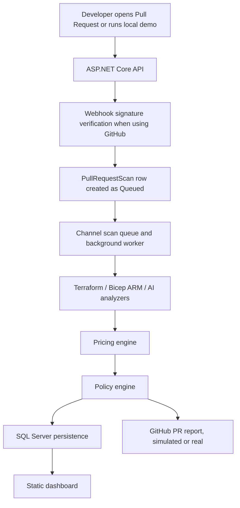

# Cloud & AI Spend Governor

Cloud & AI Spend Governor is an MVP SaaS-style developer tool for PR-time cloud and AI spend guardrails.

It acts as a CI/CD cost firewall: when a pull request changes infrastructure-as-code or AI workflow configuration, the app estimates the monthly cost impact, evaluates budget rules, persists the scan, and reports PASS/WARN/FAIL in the dashboard and GitHub PR feedback.

Suggested GitHub repository description:

```txt
CI/CD cost firewall for cloud and AI spend. Built with ASP.NET Core, EF Core, SQL Server, GitHub webhooks, Terraform/Bicep analysis, and Azure pricing.
```

## Overview

Traditional FinOps dashboards usually explain spend after it has happened. Cloud & AI Spend Governor moves cost visibility earlier, before merge and deploy.

The MVP supports local/private-beta demos with SQL Server persistence, seeded scan scenarios, simulated GitHub reporting, and optional real GitHub App publishing. It is intentionally scoped: no billing, SSO, Slack, AWS/GCP, Azure DevOps, or production hosting automation is included.

## Problem

Cloud and AI costs are often discovered after the invoice arrives. Infrastructure changes can quietly introduce premium SKUs, extra replicas, or always-on services. AI workflow changes can multiply token spend through model choice, prompt size, output size, and run frequency.

Developers need fast, explainable cost feedback while the pull request is still easy to fix.

## Solution

Cloud & AI Spend Governor analyzes PR inputs and answers:

- What resources or AI workflows changed?
- What is the estimated monthly cost impact?
- Which assumptions and pricing sources were used?
- Does the change pass the project/environment budget rules?
- What should the developer change before merge?

## Core Workflow



Manual dashboard/demo scans use the same scan execution service synchronously so the UI can show the completed result immediately. Webhook scans are queued and processed by a hosted background worker.

## Tech Stack

- .NET 10 ASP.NET Core minimal API.
- Static HTML/CSS/JavaScript dashboard served by the API.
- EF Core with SQL Server LocalDB for local development.
- SQL Server container support through Docker Compose.
- GitHub webhook receiver plus simulated and real GitHub App PR reporting modes.
- Terraform plan JSON, raw Terraform, Bicep compiled ARM JSON, raw Bicep, and AI workflow analyzers.
- Versioned local pricing catalogs with optional Azure Retail Prices API lookup.
- GitHub Actions CI, Docker packaging, health checks, request correlation IDs, and structured console logging.

## Architecture

See [docs/architecture.md](docs/architecture.md) for the detailed system architecture, scan lifecycle, database model, analyzer flow, pricing flow, and GitHub integration flow.

## Features

- Local user/workspace/project model for private-beta demos.
- Project-scoped repositories and environment budgets.
- Development-only demo seed/reset flow.
- Persisted scan lifecycle: Queued, Running, Completed, Failed.
- Cost breakdown rows, detected resources, assumptions, and policy evaluations per scan.
- PASS/WARN/FAIL policy decisions from `.spendgov.yml` and project budgets.
- GitHub PR report rendering with idempotent simulated/real publishing.
- CSV exports for resources, policy findings, recommendations, and project summaries.
- Health endpoint at `GET /health`.

## Engineering Highlights

- Unified scan execution path for dashboard, demo, rerun, and queued webhook processing.
- EF Core persistence model for workspaces, projects, repositories, scans, cost breakdowns, detected resources, assumptions, policy evaluations, and GitHub publishing metadata.
- Analyzer priority favors structured artifacts: Terraform plan JSON first, then Bicep compiled ARM JSON, with pragmatic raw IaC fallbacks.
- Explainable pricing metadata: catalog version/source, Azure Retail source, match type, fallback reason, region, SKU, and confidence impact.
- GitHub reporting preserves scan data even when PR publishing fails.
- Scenario test suite covers analyzers, pricing, confidence, policy, persistence, GitHub signatures/reporting, and queue behavior.
- Local Docker/SQL Server path plus LocalDB path for demos.

## Screenshots

No screenshots are committed yet. Capture real screenshots after running the local demo and place them in `docs/assets/`.

Recommended screenshot list:

- Dashboard scan history.
- Cheap PASS scan detail.
- Expensive cloud FAIL scan detail.
- Expensive AI workflow scan detail.
- Pricing metadata and cost breakdown sections.
- Workspace/project budget page.
- Simulated or real GitHub PR report.

See [docs/screenshots.md](docs/screenshots.md).

## Demo Script

Use the 3-5 minute walkthrough in [docs/demo-script.md](docs/demo-script.md).

Short version:

1. Open the dashboard at http://localhost:5102.
2. Seed demo data.
3. Show latest scans.
4. Open the cheap cloud change and explain PASS.
5. Open the expensive cloud change and explain FAIL.
6. Open the expensive AI workflow and explain token-based cost estimation.
7. Show the generated PR report shape and explain simulated/real GitHub modes.

## Local Development

Prerequisites:

- .NET SDK 10.x.
- SQL Server LocalDB or Docker.
- Optional: GitHub CLI/ngrok/cloudflared for real webhook testing.

Run locally:

```powershell
dotnet restore CloudAiSpendGovernor.slnx --configfile NuGet.Config
dotnet build CloudAiSpendGovernor.slnx
dotnet ef database update --project src\SpendGovernor.Infrastructure\SpendGovernor.Infrastructure.csproj --startup-project src\SpendGovernor.Api\SpendGovernor.Api.csproj --context SpendGovernorDbContext
dotnet run --project src\SpendGovernor.Api\SpendGovernor.Api.csproj --urls http://localhost:5102
```

Open http://localhost:5102 and register a local user, or use the development fallback user `demo@spendgov.local`.

Detailed setup: [docs/local-development.md](docs/local-development.md).

## Docker Setup

```powershell
Copy-Item .env.example .env
notepad .env
docker compose up --build
```

The Docker Compose setup starts the API and SQL Server. Set a local `SA_PASSWORD` in `.env`; do not commit `.env`.

## Database Migrations

Apply migrations:

```powershell
dotnet ef database update --project src\SpendGovernor.Infrastructure\SpendGovernor.Infrastructure.csproj --startup-project src\SpendGovernor.Api\SpendGovernor.Api.csproj --context SpendGovernorDbContext
```

Troubleshooting: [docs/local-migrations.md](docs/local-migrations.md).

## GitHub App / Webhook Setup

The MVP supports two modes:

- `Simulated`: local/demo mode that persists an idempotent simulated PR report.
- `Real`: GitHub App mode that creates or updates a PR comment and can create/update a check run.

Real mode requires a GitHub App id, private key, installation id, webhook secret, and repository permissions. See [docs/github-setup.md](docs/github-setup.md).

## Configuration

Examples:

- [.env.example](.env.example) for Docker Compose.
- [src/SpendGovernor.Api/appsettings.Example.json](src/SpendGovernor.Api/appsettings.Example.json) for app configuration shape.
- [src/SpendGovernor.Api/appsettings.Docker.json](src/SpendGovernor.Api/appsettings.Docker.json) for Docker defaults.

Important environment variables:

```txt
ConnectionStrings__SpendGovernorDb
GitHub__Mode
GitHub__WebhookSecret
GitHub__AppId
GitHub__PrivateKeyPath
GitHub__PrivateKey
GitHub__EnableCheckRuns
Pricing__AzureRetailPrices__Enabled
```

Committed config intentionally leaves secrets blank.

## Testing

Run the scenario suite:

```powershell
dotnet run --project tests\SpendGovernor.Tests\SpendGovernor.Tests.csproj
```

The test project is a console scenario runner rather than an xUnit project. CI runs this command after build. See [docs/testing.md](docs/testing.md).

## Project Structure

```txt
src/
  SpendGovernor.Api/              ASP.NET Core API, static dashboard, demo data, GitHub integration, scan worker
  SpendGovernor.Core/             Domain model, analyzers, pricing, policy, PR report rendering
  SpendGovernor.Infrastructure/   EF Core persistence, migrations, repositories, pricing catalog services

tests/
  SpendGovernor.Tests/            Console scenario test suite

demo/
  scenario-*                      Demo Terraform/AI scenarios
  terraform-plan-json/            Terraform plan JSON fixtures
  bicep-arm-json/                 Compiled ARM JSON fixtures

docs/
  architecture.md
  demo-script.md
  sample-pr-report.md
  cv-bullets.md
  roadmap.md
  limitations.md
  local-development.md
  github-setup.md
  testing.md
  screenshots.md
  portfolio-release-checklist.md
```

## Sample PR Report

See [docs/sample-pr-report.md](docs/sample-pr-report.md) for a realistic report showing status, monthly impact, cost drivers, policy findings, assumptions, pricing metadata, analysis source, and recommendations.

## Known MVP Limitations

See [docs/limitations.md](docs/limitations.md). In short:

- Local/private-beta optimized; not production hosting ready.
- LocalDB/Docker SQL Server for demos; managed production database not packaged.
- Azure only for cloud resource estimation.
- Pricing is estimate-based, not customer-billing ingestion.
- Terraform/Bicep support relies on structured artifacts where possible and pragmatic fallbacks otherwise.
- GitHub real mode exists, but local demos normally use simulated mode.
- No Stripe, Slack, AWS/GCP, Azure DevOps, SSO, enterprise RBAC, or Azure Cost Management ingestion.

## Roadmap

See [docs/roadmap.md](docs/roadmap.md) for completed MVP scope and next steps.

## Portfolio Release Checklist

See [docs/portfolio-release-checklist.md](docs/portfolio-release-checklist.md) for the final manual checks before pinning the repository.

## CV / Portfolio Summary

Cloud & AI Spend Governor is a .NET SaaS-style project that acts as a CI/CD cost firewall for cloud and AI spend. It analyzes Terraform/Bicep/ARM and AI workflow changes, estimates monthly cost impact, evaluates environment budgets, persists scan history, and reports actionable recommendations in GitHub Pull Requests and a dashboard.

Ready-to-use CV bullets are in [docs/cv-bullets.md](docs/cv-bullets.md).
