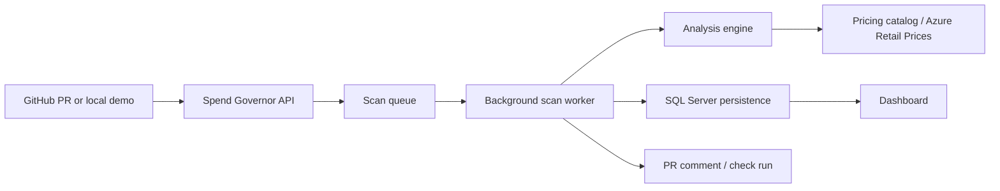

# Cloud-AI-Spend-Governor

Cloud & AI Spend Governor is an MVP SaaS prototype for PR-time cloud and AI spend guardrails.

## Problem

Cloud cost reviews usually happen after infrastructure has already been deployed. AI workflow costs are even easier to miss because token volume, model choice, and run frequency often live in application configuration instead of billing dashboards. Teams need PR-time feedback that is understandable to developers, persisted for audit/demo purposes, and safe to run locally without cloud credentials.

## Solution

Spend Governor analyzes pull request inputs, estimates Azure and AI monthly cost impact, evaluates policy-as-code thresholds, persists the scan, and produces the same report in the dashboard and GitHub PR feedback. Local demos use SQL Server LocalDB or Docker SQL Server, simulated GitHub reporting, and seeded scenarios so the product can be shown end-to-end without a real webhook.

## Tech Stack

- .NET 10 minimal API and static dashboard.
- EF Core with SQL Server LocalDB for local development and SQL Server container support for Docker demos.
- Azure/Terraform/Bicep ARM JSON analyzers with versioned local pricing catalogs and optional Azure Retail Prices API lookup.
- GitHub App webhook/reporting flow with simulated local mode and real PR comment/check-run mode.
- In-memory channel-backed background scan queue for webhook lifecycle demos.
- Console scenario test suite plus GitHub Actions CI.

## Architecture



## Core Flow

1. A dashboard demo, manual run, or GitHub webhook creates a `PullRequestScan` row with `Queued` status.
2. Webhook scans are processed by the hosted background worker; manual and demo scans use the same execution service synchronously so demos return completed details immediately.
3. The analyzer chooses the strongest available IaC artifact: Terraform plan JSON, Bicep compiled ARM JSON, raw Bicep, raw Terraform, then other configured analyzers.
4. Cost breakdowns, detected resources, assumptions, policy evaluations, confidence, and GitHub publishing metadata are stored in SQL Server.
5. The dashboard and GitHub PR report read from the same scan result.

## Production/Demo Readiness

- CI: `.github/workflows/ci.yml` restores, builds, runs the scenario suite, and publishes the API artifact.
- Docker: `Dockerfile`, `.dockerignore`, `docker-compose.yml`, `appsettings.Docker.json`, and `.env.example` support a local app plus SQL Server container demo.
- Health: `GET /health` checks the API process and database connectivity.
- Observability: each request receives an `X-Correlation-ID` response header; scan logs include scan, project, repository, PR, and correlation identifiers.
- Safety: committed config contains no real webhook secret, app private key, token, or database password.

## Engineering Highlights

- Unified scan execution path for dashboard, demo, rerun, and queued webhook processing.
- Persisted scan lifecycle with queued/running/completed/failed states and report publishing metadata.
- ARM/Bicep support favors compiled ARM JSON while retaining raw Bicep fallback.
- Pricing confidence is explicit and lowered when pricing fields are unresolved or approximate.
- GitHub reporting is idempotent and preserves scan data when PR publishing fails.
- Local demo data proves the product value without depending on live cloud APIs.

## Run

```powershell
dotnet restore CloudAiSpendGovernor.slnx --configfile NuGet.Config
dotnet build CloudAiSpendGovernor.slnx
dotnet run --project src\SpendGovernor.Api\SpendGovernor.Api.csproj --urls http://localhost:5102
```

Open http://localhost:5102 and use `demo@spendgov.local`, or register a local beta user from the sidebar.

## Docker Demo

Copy the example environment file and choose a local SQL password:

```powershell
Copy-Item .env.example .env
notepad .env
docker compose up --build
```

Open http://localhost:5102. The Compose app uses SQL Server in a container and simulated GitHub reporting. Apply EF migrations from the host before the first full demo if the database is empty:

```powershell
dotnet ef database update --project src\SpendGovernor.Infrastructure\SpendGovernor.Infrastructure.csproj --startup-project src\SpendGovernor.Api\SpendGovernor.Api.csproj --context SpendGovernorDbContext
```

For Docker, the connection string is supplied by `docker-compose.yml` through `ConnectionStrings__SpendGovernorDb`.

## CI

GitHub Actions runs on pushes to `main`/`develop` and on pull requests:

```txt
restore -> build -> scenario tests -> publish API artifact
```

The test step intentionally runs the console scenario suite:

```bash
dotnet run --configuration Release --no-build --project tests/SpendGovernor.Tests/SpendGovernor.Tests.csproj
```

## Health And Logs

```powershell
Invoke-RestMethod http://localhost:5102/health
```

Every response includes `X-Correlation-ID`. Send the same header from a client to trace a request through logs:

```powershell
Invoke-RestMethod http://localhost:5102/api/me -Headers @{ "X-Correlation-ID" = "demo-run-001" }
```

## Local Demo Data

Demo seeding is available only when the API runs in `Development`.

From the dashboard:

1. Open http://localhost:5102.
2. Click `Seed Demo Data`.
3. Open `Analyses` and select each seeded PR scan.
4. Click `Reset Demo Data` when you want to clear the demo repository and scan rows.

From PowerShell:

```powershell
Invoke-RestMethod -Method Post http://localhost:5102/api/dev/demo/seed
Invoke-RestMethod -Method Delete http://localhost:5102/api/dev/demo/reset
```

The seed flow recreates repository `acme/spend-governor-demo` in SQL Server LocalDB and writes three completed scans:

- `Cheap change`: PASS, small storage account plus small App Service plan, small monthly delta, high confidence.
- `Expensive cloud change`: FAIL, premium Redis and larger always-on cloud capacity, high monthly delta.
- `Expensive AI workflow`: WARN, `gpt-4.1` at 10,000 monthly runs, 8,000 input tokens, and 2,000 output tokens.

## Private Beta Workspace Model

Local beta persistence now includes:

- `ApplicationUsers`: lightweight local users with PBKDF2 password hashes for register/login demos.
- `Workspaces`: tenant boundary for teams.
- `WorkspaceMembers`: user membership with `Owner` or `Member` role values.
- `Projects`: cloud governance projects inside a workspace.
- `Repositories`: GitHub repositories scoped to a project, so the same GitHub repo can be tracked by multiple projects.
- `EnvironmentBudgets`: per-project environment budget rows for `dev`, `staging`, `production`, or custom environments.

The dashboard supports register, login, logout, workspace creation, project creation, and budget editing. The `X-User-Email` development header still works for quick local switching, while cookie auth is used after login/register.

Environment budget rows are translated into the effective `.spendgov.yml` used by the scan engine. Updating budgets in the dashboard updates the generated policy view and changes future scan decisions. If a repository supplies `.spendgov.yml` in the scan payload, that file still overrides/refines the project default for that scan; otherwise the database project budgets are the source of truth.

## Environment Variables

The MVP runs without secrets for local demos because GitHub defaults to `Simulated` mode.

- `GitHub:Mode` or `GitHub__Mode`: `Simulated` for local demos, `Real` for GitHub App API posting.
- `GitHub:AppId` or `GitHub__AppId`: GitHub App id, required only in `Real` mode.
- `GitHub:PrivateKeyPath` or `GitHub__PrivateKeyPath`: path to the GitHub App private key PEM, required in `Real` mode unless `GitHub:PrivateKey` is supplied.
- `GitHub:PrivateKey` or `GitHub__PrivateKey`: PEM contents for hosted/dev environments. Do not commit this.
- `GitHub:WebhookSecret` or `GitHub__WebhookSecret`: webhook HMAC secret. Keep blank for dashboard-only demos; set it before accepting signed GitHub webhook deliveries.
- `GitHub:EnableCheckRuns` or `GitHub__EnableCheckRuns`: `true` to publish check runs in `Real` mode.
- `GitHub:BotCommentMarker` or `GitHub__BotCommentMarker`: marker used to find/update the bot PR comment. Defaults to `<!-- cloud-ai-spend-governor-report -->`.
- `GitHub:AllowUnsignedWebhooksInDevelopment` or `GitHub__AllowUnsignedWebhooksInDevelopment`: optional local-only escape hatch. Keep `false` unless you are testing unsigned local payloads.
- `ASPNETCORE_URLS`: optional server URL override, for example `http://localhost:5102`.
- `ConnectionStrings:SpendGovernorDb` or `ConnectionStrings__SpendGovernorDb`: SQL Server LocalDB connection string.

Development defaults to:

```txt
Server=(localdb)\MSSQLLocalDB;Database=Spend-Governor;Trusted_Connection=True;TrustServerCertificate=True;MultipleActiveResultSets=true
```

In `Simulated` mode the app verifies webhook signatures, persists the scan, and stores an idempotent simulated PR comment/check result for beta demos. In `Real` mode it creates a GitHub App JWT, exchanges it for an installation token, updates or creates one PR comment, and optionally creates or updates a check run.

## GitHub Webhook Setup

For local simulated webhook testing, send `POST /api/github/webhooks` with:

- `X-Hub-Signature-256: sha256=<hmac>` using the configured webhook secret.
- Standard `repository`, `installation`, and `pull_request` objects.
- Optional MVP local fields:
  - `spendgov_changed_files`: array of changed paths.
  - `spendgov_baseline_files`: array of `{ "path": "...", "content": "..." }`.
  - `spendgov_proposed_files`: array of `{ "path": "...", "content": "..." }`.

Repeated deliveries for the same repository and PR update one stored Spend Governor comment instead of creating duplicates.

Supported pull request actions are `opened`, `synchronize`, `reopened`, and `ready_for_review`.

## GitHub App Real Mode

Create a GitHub App with these repository permissions:

- Metadata: read-only.
- Contents: read-only.
- Pull requests: read-only.
- Issues: read and write. Pull request comments use the Issues comments API.
- Checks: read and write, if `GitHub:EnableCheckRuns` is `true`.

Subscribe the app to the `Pull request` event and set the webhook URL to your public tunnel:

```powershell
ngrok http 5102
```

Use the ngrok HTTPS URL plus `/api/github/webhooks`, for example:

```txt
https://example.ngrok-free.app/api/github/webhooks
```

Generate a private key for the GitHub App and keep it outside the repository. Then run the API with Real mode settings:

```powershell
$env:GitHub__Mode = "Real"
$env:GitHub__AppId = "<your-app-id>"
$env:GitHub__PrivateKeyPath = "C:\Users\alex1\secrets\spendgov-github-app.pem"
$env:GitHub__WebhookSecret = "<same-secret-configured-in-github>"
$env:GitHub__EnableCheckRuns = "true"
dotnet run --project src\SpendGovernor.Api\SpendGovernor.Api.csproj --urls http://localhost:5102
```

Install the app on the repository you want to demo. Webhook-triggered scans use the installation id from the webhook payload and persist it on the repository row. Manual dashboard scans should stay in `Simulated` mode unless the project has been linked to a GitHub installation through the install callback.

## Terraform Plan JSON Support

The analyzer now detects Terraform plan JSON artifacts and uses them before the pragmatic `.tf` parser. This improves infrastructure diff accuracy because the plan contains Terraform's before/after resource values and action list.

Generate a plan JSON artifact in CI or locally:

```bash
terraform init
terraform plan -out=tfplan
terraform show -json tfplan > tfplan.json
```

Supported plan file names are:

- `tfplan.json`
- `terraform-plan.json`
- `plan.json`

Supported locations are repository root, `infra/`, `infrastructure/`, `terraform/`, and `.iac/`. If a valid Terraform plan JSON with `resource_changes` is present, the app uses it for Terraform resources. If no plan JSON is present, the existing Terraform `.tf` parser remains the fallback.

The plan parser supports create, update, delete, and replace actions for Azure Terraform resources such as App Service plans, web apps, Redis, SQL databases, storage accounts, Kubernetes clusters, Container Apps, and Log Analytics workspaces. Unknown resource types are still shown as detected resources with low confidence instead of crashing the scan.

Demo fixtures live in:

- `demo/terraform-plan-json/cheap-change/tfplan.json`
- `demo/terraform-plan-json/expensive-cloud-change/tfplan.json`
- `demo/terraform-plan-json/sku-upgrade/tfplan.json`

The web app does not run `terraform plan` directly. Running Terraform can require credentials, provider plugin downloads, network access, and evaluation of untrusted IaC. The recommended MVP flow is to generate `tfplan.json` in CI and pass that artifact to the app/webhook payload.

Example GitHub Actions job for producing the artifact:

```yaml
name: Spend Governor Terraform Plan

on:
  pull_request:
    paths:
      - "infra/**"
      - "terraform/**"

jobs:
  terraform-plan:
    runs-on: ubuntu-latest

    steps:
      - uses: actions/checkout@v4

      - name: Setup Terraform
        uses: hashicorp/setup-terraform@v3

      - name: Terraform Init
        working-directory: infra
        run: terraform init

      - name: Terraform Plan
        working-directory: infra
        run: terraform plan -out=tfplan

      - name: Export Terraform Plan JSON
        working-directory: infra
        run: terraform show -json tfplan > tfplan.json

      # Current MVP consumption path:
      # include infra/tfplan.json in the proposed file payload sent to /api/github/webhooks
      # or use the local dashboard/manual analysis flow with this file in ProposedFiles.
```

## Bicep Compiled ARM JSON Support

The analyzer detects compiled ARM template JSON generated from Bicep and uses it before the raw `.bicep` parser. Compiled ARM JSON is preferred because it contains a structured `resources[]` array with Azure resource types, API versions, SKU blocks, properties, dependencies, copy loops, and conditions. The raw Bicep parser remains as a fallback for demos or repositories that have not generated ARM JSON yet.

Recommended local or CI command:

```bash
az bicep build --file infra/main.bicep --outfile infra/main.json
```

Supported ARM JSON file names are:

- `main.json`
- `azuredeploy.json`
- `arm-template.json`
- `template.json`
- `bicep-output.json`
- `compiled-arm.json`

Supported locations are repository root, `infra/`, `infrastructure/`, `bicep/`, `azure/`, `iac/`, and `.iac/`. The app does not treat every JSON file as infrastructure. A candidate must look like an ARM deployment template, for example with a deployment-template `$schema`, `contentVersion`, and a top-level `resources` array, or a top-level `resources` array containing Azure resource objects.

Azure IaC analyzer priority is:

1. Terraform plan JSON, if available.
2. Bicep compiled ARM JSON, if available.
3. Raw Bicep parser fallback.
4. Raw Terraform `.tf` parser fallback.
5. Other configured analyzers, including AI spend config.

Supported ARM resource extraction currently includes App Service plans, web apps, Redis, SQL databases, storage accounts, AKS clusters, Container Apps, Log Analytics workspaces, PostgreSQL flexible servers, MySQL flexible servers, and Container Registry. ARM resource types are mapped to the existing Azure/Terraform-style pricing model where possible, for example `Microsoft.Web/serverfarms` maps to `azurerm_service_plan`, and `Microsoft.Cache/Redis` maps to `azurerm_redis_cache`.

The parser resolves literal values, simple `parameters('name')` references with `defaultValue`, and simple `variables('name')` references. Complex ARM expressions such as `concat`, `format`, `if`, nested functions, and `resourceId` are not evaluated. They are stored as unresolved assumptions and can lower confidence when they affect pricing fields such as SKU or region.

ARM template JSON describes desired state, not a full before/after diff. The MVP treats ARM template resources as added or unknown unless baseline/proposed files are already available through the existing scan payload. Assumptions include:

- `AnalysisSource = Bicep compiled ARM JSON`
- `ArmTemplateFormat = ARM deployment template JSON`
- `ArmTemplateDiffMode = DesiredStateOnly`
- resolved parameter and variable values, when available
- unresolved ARM expressions, when present

Dashboard scan details show ARM/Bicep metadata for detected resources: source file, ARM type, mapped pricing type, resource name, location, SKU, API version, kind, pricing match, estimated monthly delta, confidence, and resolved/unresolved expression notes. GitHub PR reports include an `Analysis source` section and an ARM resource table when compiled ARM JSON is used.

Demo fixtures live in:

- `demo/bicep-arm-json/cheap-change/main.json`
- `demo/bicep-arm-json/expensive-cloud-change/main.json`
- `demo/bicep-arm-json/parameterized-template/main.json`

For local dashboard testing, use the `Run Demo PR` control and select `Bicep ARM cheap change`, `Bicep ARM expensive change`, or `Bicep ARM parameterized`. Those demo PRs persist scan rows and show ARM/Bicep details in the analysis detail view. The Development-only `Seed Demo Data` button still seeds the original three product-demo scans.

Security note: the web app does not run `az bicep build`, Azure CLI, or arbitrary IaC commands. Build Bicep to ARM JSON in CI or locally, then pass the generated JSON file to the app. Running build tools inside the app would require external tooling, filesystem access, and untrusted-code execution controls that are out of scope for the MVP.

Example GitHub Actions job for producing the Bicep ARM JSON artifact:

```yaml
name: Spend Governor Bicep Build

on:
  pull_request:
    paths:
      - "infra/**"
      - "bicep/**"

jobs:
  bicep-build:
    runs-on: ubuntu-latest

    steps:
      - uses: actions/checkout@v4

      - name: Azure CLI - Build Bicep
        run: az bicep build --file infra/main.bicep --outfile infra/main.json

      # Current MVP consumption path:
      # include infra/main.json in the proposed file payload sent to /api/github/webhooks
      # or use the local dashboard/manual analysis flow with this file in ProposedFiles.
```

## Pricing Catalog v2

Cloud and AI estimates now use versioned local JSON catalogs instead of live pricing APIs:

- `src/SpendGovernor.Infrastructure/Pricing/Catalogs/azure-pricing-catalog.v2026.07.01.json`
- `src/SpendGovernor.Infrastructure/Pricing/Catalogs/ai-pricing-catalog.v2026.07.01.json`

The catalogs are loaded at API startup, validated, copied to the build output, and used by the test runner. Each catalog has provider, version, source, currency, default region, effective date, and line-item pricing metadata. The MVP intentionally keeps these prices local and reviewable so demos do not depend on Azure Retail Prices, OpenAI pricing pages, billing credentials, or network access.

Cloud lookup priority is:

1. Exact region + SKU.
2. Default-region SKU fallback.
3. SKU-only fallback.
4. Resource-type fallback.
5. Provider fallback.
6. Unknown price.

Exact matches can produce High confidence. Default-region and SKU-only fallbacks produce Medium confidence. Resource-type, provider, manual, or unknown fallbacks lower confidence and include a fallback reason in assumptions, dashboard details, and PR markdown.

AI workflow estimates use model, monthly runs, average input tokens, average output tokens, and catalog input/output prices per 1M tokens. For the demo `gpt-4.1` workflow, 10,000 runs with 8,000 input tokens and 2,000 output tokens produces a local catalog estimate of `EUR 320.00/month`.

To update prices, edit or add entries in the JSON catalogs, keep the version/effective date accurate, then run:

```powershell
dotnet run --project tests\SpendGovernor.Tests\SpendGovernor.Tests.csproj
```

To verify pricing metadata in the app:

1. Run the API in Development and seed demo data.
2. Open a scan detail page.
3. Confirm `Pricing Metadata`, resource-level `Pricing`, cost breakdown reasons, assumptions, and policy evaluations show the catalog version, source, match type, and fallback reason where relevant.
4. For webhook scans, confirm the PR report includes `Pricing metadata` and `AI pricing metadata` sections.

## Azure Retail Prices API Integration

Azure cloud estimates can optionally use the unauthenticated Azure Retail Prices API before falling back to the local Pricing Catalog v2. This improves estimate credibility for supported Azure resources while preserving offline demo behavior.

Default local/demo mode keeps live pricing disabled:

```json
{
  "Pricing": {
    "AzureRetailPrices": {
      "Enabled": false,
      "BaseUrl": "https://prices.azure.com/api/retail/prices",
      "ApiVersion": "2023-01-01-preview",
      "CurrencyCode": "EUR",
      "DefaultRegion": "westeurope",
      "TimeoutSeconds": 10,
      "CacheTtlHours": 24,
      "MaxPages": 5,
      "FallbackToLocalCatalog": true,
      "DefaultStorageGb": 100,
      "DefaultLogAnalyticsGb": 10
    }
  }
}
```

Enable live pricing for a local run:

```powershell
$env:Pricing__AzureRetailPrices__Enabled = "true"
dotnet run --project src\SpendGovernor.Api\SpendGovernor.Api.csproj --urls http://localhost:5102
```

Disable it for offline demos:

```powershell
$env:Pricing__AzureRetailPrices__Enabled = "false"
```

When enabled, the pricing flow is:

1. Normalize the Azure region, for example `West Europe`, `EU West`, or `westeurope` to `westeurope`.
2. Build Azure Retail Prices API candidate filters for the detected resource type, SKU, region, and currency.
3. Fetch paged API results with `HttpClientFactory`, timeout handling, and an in-memory cache.
4. Select the best consumption/on-demand meter and ignore reservation, savings plan, DevTest, and Spot prices.
5. Convert hourly or GB-month units into monthly estimates.
6. If no reliable live price is found, use Pricing Catalog v2 when `FallbackToLocalCatalog` is `true`.

Supported live-pricing resource mappings currently include App Service plans, web apps through App Service pricing, Redis, SQL Database, Storage Accounts, Log Analytics, Container Apps, AKS node pricing, virtual machines, and VM scale sets. AI token pricing remains on Pricing Catalog v2; this task does not fetch live OpenAI or Azure OpenAI pricing.

Match quality affects confidence:

- High: exact Azure Retail region and SKU match with straightforward monthly conversion.
- Medium: approximate live SKU match, ambiguous meter selection, defaulted region, or usage assumptions.
- Low: live lookup failed and local fallback was used, unsupported resource type, unknown unit conversion, or unknown price.

Dashboard scan details show whether the live API was used, source, currency, region, unit price, unit of measure, monthly conversion assumption, meter/product/SKU, match type, fallback reason, and effective start date when available. GitHub PR reports include the same pricing metadata without exposing internal exception stack traces.

Azure Cost Management API is intentionally not used yet. Retail Prices API provides public rate-card style prices, not customer-specific billing, negotiated discounts, reservations, savings plans, or actual usage ingestion.

## .spendgov.yml Example

```yaml
version: 1
currency: EUR
defaultRegion: westeurope
hoursPerMonth: 730

rules:
  - id: dev-delta-limit
    description: Block dev PRs above 100 EUR/month
    type: monthly_delta
    threshold: 100
    action: block

environments:
  dev:
    monthlyBudget: 100
    action: block
  production:
    monthlyBudget: 3000
    action: block

ai:
  enabled: true
  monthlyBudget: 300
  maxCostPerWorkflowMonthly: 100
  action: warn
```

Supported rule types: `monthly_delta`, `proposed_monthly_cost`, `environment_budget`, `unknown_resource_count`, `ai_monthly_cost`, `ai_workflow_cost`.

## Demo Script

The short presenter version lives in `docs/demo-script.md`.

1. Open http://localhost:5102 and register/login, or use `demo@spendgov.local`.
2. Show workspace/project selection, then click `Seed Demo Data`.
3. Show `Latest Analyses`: repository, PR number, environment, status, decision, monthly delta, confidence, and created/completed timestamps are loaded from persisted scan rows.
4. Open `Cheap change` and explain PASS: the estimated delta is small, confidence is High, and no blocking action is needed.
5. Open `Expensive cloud change` and explain FAIL: the dev budget policy catches premium Redis / larger cloud capacity and recommends a cheaper environment-specific SKU.
6. Open `Expensive AI workflow` and explain AI spend estimation: `gpt-4.1`, 10,000 monthly runs, 8,000 input tokens, and 2,000 output tokens produce the monthly AI estimate.
7. Open `Policies`, adjust an environment budget, save it, and explain that future scans use the generated effective `.spendgov.yml`.
8. Explain that real usage posts the same report back to the GitHub Pull Request as an idempotent PR comment/check.

Demo files live in `demo/scenario-cheap-change`, `demo/scenario-expensive-cloud-change`, and `demo/scenario-expensive-ai-workflow`.
Terraform plan JSON demos live in `demo/terraform-plan-json`.
Bicep compiled ARM JSON demos live in `demo/bicep-arm-json`.

## Screenshots And Demo Assets

Screenshot placeholders and capture guidance live in `docs/assets/README.md`. Recommended portfolio captures:

- Dashboard with seeded latest scans.
- Cheap PASS scan detail.
- Expensive cloud FAIL scan detail.
- Expensive AI workflow scan detail.
- GitHub PR report markdown or simulated comment state.

## Test

```powershell
dotnet run --project tests\SpendGovernor.Tests\SpendGovernor.Tests.csproj
```

The console test runner covers the MVP scenarios from `mvp-features-en.md`: no cloud impact, small VM, SKU threshold, unknown resource, expensive AI workflow, approval required, Azure resource coverage, Terraform plan JSON parsing/deltas/error handling, Bicep compiled ARM JSON detection/parsing/expression handling/persistence/reporting, config validation, confidence scoring, PR comment formatting, idempotent PR comments, queue round-trip behavior, and persistence.

## Database

The app uses EF Core with SQL Server LocalDB for private-beta persistence. The expected database is:

```txt
(localdb)\MSSQLLocalDB / Spend-Governor
```

Apply migrations:

```powershell
dotnet ef database update --project src\SpendGovernor.Infrastructure\SpendGovernor.Infrastructure.csproj --startup-project src\SpendGovernor.Api\SpendGovernor.Api.csproj --context SpendGovernorDbContext
```

Migration troubleshooting lives in `docs/local-migrations.md`.

The private-beta user/workspace/project migration is `AddWorkspaceProjectUserModel`. After applying migrations, SQL Server Object Explorer should show:

- `ApplicationUsers`
- `Workspaces`
- `WorkspaceMembers`
- `Projects`
- `EnvironmentBudgets`
- `Repositories`
- `PullRequestScans`
- `CostBreakdownItems`
- `DetectedResources`
- `ScanAssumptions`
- `PolicyEvaluations`
- `__EFMigrationsHistory`

To verify the persistence flow, run the app, trigger a dashboard demo scan, then open the analysis detail. The scan list/detail endpoints read from SQL Server, not only in-memory state.

To verify seeded demo data in SQL Server Object Explorer:

1. Open `(localdb)\MSSQLLocalDB`.
2. Expand database `Spend-Governor`.
3. Open `ApplicationUsers`, `Workspaces`, `WorkspaceMembers`, and `Projects` and confirm the demo or registered beta user owns a workspace and project.
4. Open `EnvironmentBudgets` and confirm rows for `dev`, `staging`, and `production`.
5. Open `Repositories` and confirm `acme/spend-governor-demo` has a `ProjectId`.
6. Open `PullRequestScans` and confirm three `Completed` scans plus `GitHubCommentId`, `GitHubCheckRunId`, `GitHubReportUrl`, `ReportPublishingStatus`, and `ReportPublishingError`.
7. Open `CostBreakdownItems`, `DetectedResources`, `ScanAssumptions`, and `PolicyEvaluations` and confirm rows for each scan.
8. In `CostBreakdownItems`, confirm `PricingCatalogVersion`, `PricingSource`, `PricingMatchType`, and `PricingFallbackReason` are populated for priced changes.

## Implemented MVP Slice

- EF-backed users, workspaces, workspace memberships, projects, project-scoped repositories, and environment budgets.
- Lightweight local register/login/logout for private-beta demos, with `X-User-Email` retained for development switching.
- GitHub install callback, signed webhook receiver, simulated PR reporting, and GitHub App real-mode PR comment/check publishing.
- Background webhook scan queue plus queued/running/completed/failed/skipped scan states.
- Terraform and Bicep discovery/parsing for the initial Azure resource set.
- Bicep compiled ARM JSON analysis with raw Bicep fallback.
- Normalized resource model and versioned local JSON pricing catalogs for Azure and AI.
- Monthly estimates, baseline/proposed delta, policy-as-code, approval flow, confidence scoring, recommendations, audit events.
- AI spend config v0 with token-based model pricing from the local AI catalog.
- EF Core persistence for users, workspaces, members, projects, repositories, environment budgets, PR scans, cost breakdowns, detected resources, assumptions, policy evaluations, and GitHub report publishing metadata.
- Terraform plan JSON analysis for Azure resource changes with persisted Terraform address/actions metadata and `.tf` parsing fallback.
- Dashboard for projects, analyses, scan details, policies, approvals, audit, and CSV exports.

## Known MVP Limitations

- The MVP includes a lightweight workspace/project/user model with email/password authentication and basic Owner/Member roles. Enterprise SSO, advanced RBAC, invitations, password reset, audit-grade account lifecycle, and billing are not implemented yet.
- Azure cost estimates can use Azure Retail Prices API for supported resources when enabled, with fallback to the local versioned Pricing Catalog v2. Real customer billing ingestion through Azure Cost Management is not implemented yet.
- Pricing fallback confidence is intentionally conservative; catalog gaps should be closed by adding explicit JSON entries.
- Terraform plan JSON support does not evaluate provider schemas or run Terraform; it parses existing `terraform show -json` output.
- GitHub API posting is scoped to GitHub App PR comments/check runs; Azure DevOps and Slack are not included.
- Bicep support analyzes compiled ARM JSON when available, with raw Bicep parsing kept as a fallback. Full ARM expression evaluation and before/after ARM diffing are not implemented yet.
- Raw Terraform and raw Bicep parsing remains pragmatic v0 parsing, not full language evaluation.
- No AWS, GCP, Azure DevOps, Stripe, SSO, Slack, or real Azure billing ingestion in this MVP.
