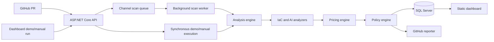
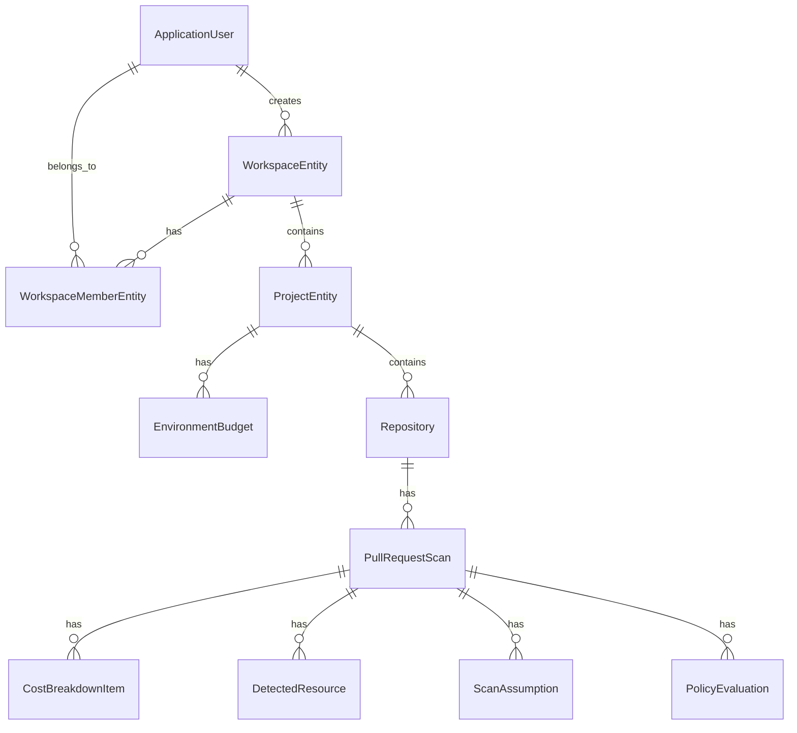
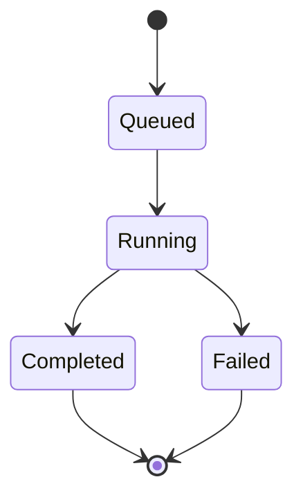
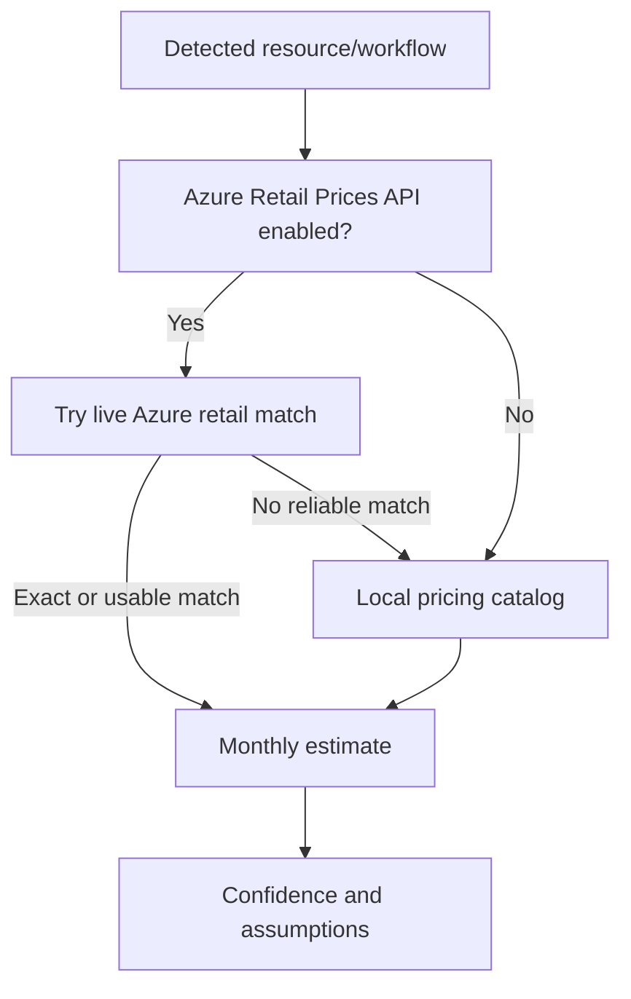
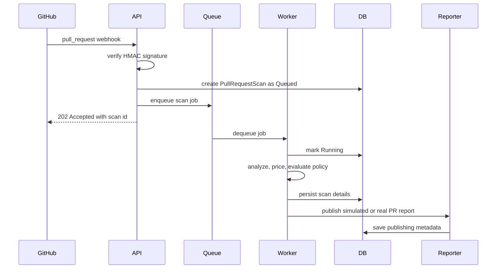

# Architecture

Cloud & AI Spend Governor is split into three .NET projects:

- `SpendGovernor.Api`: ASP.NET Core minimal API, static dashboard, demo endpoints, GitHub webhook/reporting integration, background scan queue, health checks, and local auth/workspace flows.
- `SpendGovernor.Core`: domain model, analyzers, pricing and estimation logic, policy evaluation, recommendations, CSV/report rendering, and confidence scoring.
- `SpendGovernor.Infrastructure`: EF Core persistence, SQL Server migrations, repository/scan stores, pricing catalog loading, and Azure Retail Prices API integration.

## System Architecture



## Project And Module Structure

```txt
src/
  SpendGovernor.Api/
    Program.cs                 Minimal API endpoints and middleware
    ScanProcessing.cs          Queue, worker, execution service, health check
    GitHubIntegration.cs       Simulated and real GitHub PR publishing
    SpendGovernorStore.cs      Workspace/project/demo store operations
    DemoScenarios.cs           Seeded demo requests
    wwwroot/                   Static dashboard assets

  SpendGovernor.Core/
    AnalysisEngine.cs          Scan orchestration and analyzer priority
    TerraformPlanJsonParser.cs Terraform plan JSON support
    ArmTemplateJsonParser.cs   Bicep compiled ARM JSON support
    TerraformParser.cs         Raw Terraform fallback parser
    BicepParser.cs             Raw Bicep fallback parser
    AiSpend.cs                 AI workflow config parsing
    PricingAndEstimation.cs    Cost estimation and confidence inputs
    PolicyConfig.cs            .spendgov.yml parsing
    PolicyRecommendationReporting.cs PR report rendering and CSV export

  SpendGovernor.Infrastructure/
    Persistence/               EF entities and DbContext
    Services/                  Repository/scan stores, pricing services
    Pricing/Catalogs/          Versioned local Azure and AI pricing catalogs
    Migrations/                EF Core SQL Server migrations
```

## Core Domain Model

Key persisted entities:

- `ApplicationUser`: local/private-beta user.
- `WorkspaceEntity`: tenant/team boundary.
- `WorkspaceMemberEntity`: Owner/Member relationship.
- `ProjectEntity`: cost governance project with default region/currency/policy.
- `EnvironmentBudget`: per-project environment budget settings.
- `Repository`: GitHub repository scoped to a project.
- `PullRequestScan`: persisted PR scan state and summary.
- `CostBreakdownItem`: resource/workflow-level monthly cost rows.
- `DetectedResource`: detected IaC/AI resources and raw metadata.
- `ScanAssumption`: pricing/analyzer assumptions.
- `PolicyEvaluation`: persisted rule results.

## Database Relationship Overview



## Scan Lifecycle



1. A manual run, demo seed, rerun, or GitHub webhook creates a `PullRequestScan`.
2. Manual/demo runs execute immediately through `ScanExecutionService`.
3. Webhook runs are written to `ChannelScanJobQueue` and processed by `QueuedScanWorker`.
4. The scan is marked `Running`.
5. `AnalysisEngine` produces resources, cost changes, confidence, policy findings, recommendations, and report markdown.
6. `ScanStore` persists completion/failure state and child rows.
7. `IGitHubPullRequestReporter` writes simulated or real GitHub publishing metadata.

## Analyzer Flow

Analyzer priority is implemented in the core analysis pipeline:

1. Terraform plan JSON, if present.
2. Bicep compiled ARM JSON, if present.
3. Raw Bicep parser fallback.
4. Raw Terraform `.tf` parser fallback.
5. AI spend configuration.

Structured artifacts are preferred because they contain more reliable resource type, SKU, region, and action metadata.

## Pricing Flow



Cloud pricing can use Azure Retail Prices API when enabled, with fallback to the versioned local Azure catalog. AI workflow pricing uses the local AI pricing catalog. Pricing metadata is persisted and shown in dashboard/PR reports.

## Policy Evaluation Flow

Policies come from `.spendgov.yml` when supplied in the scan payload, otherwise project/environment budget settings generate the effective policy. Rules evaluate monthly delta, proposed monthly cost, environment budget, unknown resource count, AI monthly cost, and AI workflow cost.

Final decisions map to:

- `PASS`: no blocking policy finding.
- `WARN`: warning threshold exceeded.
- `FAIL`: approval-required or block-level policy finding.

## GitHub Integration Flow



Simulated mode is used for local demos. Real mode uses GitHub App credentials to update/create one PR comment and optionally a check run.
